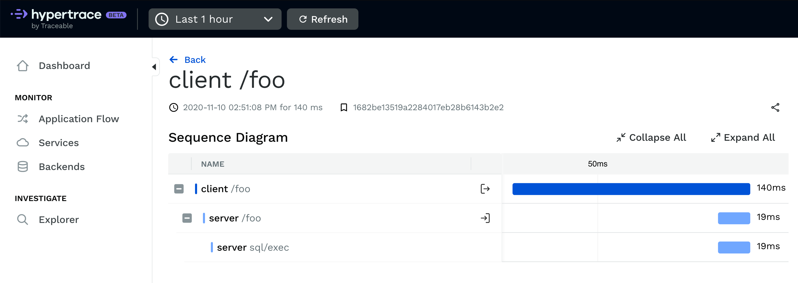

# Hypertrace Go Agent Example

This repository shows an example on how to use [Go Agent](https://github.com/hypertrace/goagent).



## Running it using Go

**Run backend:**

```bash
cd backend
go run main.go
```

**Run frontend:**

```bash
cd frontend
go run main.go
```

**Run Hypertrace and MySQL:**

```bash
docker-compose -f docker-compose-mysql.yml -f docker-compose-hypertrace.yml up --renew-anon-volumes
```

Once everything is up and running you can curl the frontend:

```bash
curl -i http://localhost:8081
```

## Running it using Docker

```bash
docker-compose -f docker-compose.yml -f docker-compose-hypertrace.yml up --renew-anon-volumes
```

Once everything is up and running (hint: check `docker ps`) you can curl the frontend:

```bash
curl -i http://localhost:8081
```
